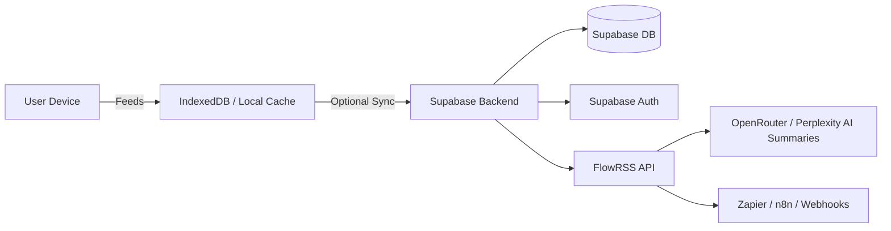

---

# **FlowRSS – Product & Technical Paper** 

---

## **1. Product Paper**

### 1.1 Overview

**Product Name:** FlowRSS
**Tagline:** “Your content, in flow.”

**Description:**
FlowRSS is a privacy-first, lightweight, cross-platform RSS reader that lets users consume content effortlessly. It works **offline-first**, requires **no signup by default**, and provides a **clean, distraction-free reading experience** with optional cloud sync and AI-powered enhancements.

**Target Users:**

* Power readers, researchers, and developers
* Privacy-conscious users tired of ad-driven platforms
* Professionals who consume multiple news/blog sources
* Newsletter migrants seeking feed-based aggregation

---

### 1.2 Market Analysis

**Competitors:**

| Product         | Model             | Pain Points                            |
| --------------- | ----------------- | -------------------------------------- |
| Feedly          | Freemium + AI Leo | Paywalls, tracking, overwhelming UI    |
| Inoreader       | Freemium          | Cluttered interface, limited free tier |
| Miniflux        | OSS self-host     | Minimal features, DIY hosting needed   |
| NewsBlur        | Freemium          | Limited free feeds, complex UI         |
| Readwise Reader | Paid $8/mo        | AI-heavy, not privacy-centric          |

**Trends:**

* Renewed interest in RSS readers due to algorithm fatigue
* Growing demand for privacy-first apps
* Users want **offline-first, full-text feeds, and AI summaries**
* Monetization possible via freemium → Pro → Team/Enterprise tiers

---

### 1.3 Unique Selling Proposition (USP)

**FlowRSS differentiators:**

* **Privacy-first:** No tracking, optional signup for cloud sync
* **Offline-first:** Feeds stored locally, works without internet
* **Clean UX:** Minimalist, distraction-free reading
* **AI-powered optional features:** Summaries, search, feed suggestions
* **Scalable monetization:** Freemium → Pro → Team → Enterprise

---

### 1.4 Feature Breakdown

#### **V1 – Launch-Ready (Weeks 1–4)**

| Feature                      | Description                               | Priority |
| ---------------------------- | ----------------------------------------- | -------- |
| Local feed storage           | IndexedDB for offline-first reading       | ✅ Core   |
| Full-text extraction         | Automatically loads complete articles     | ✅ Core   |
| Theming                      | Dark, light, sepia; font size control     | ✅ Core   |
| OPML import/export           | Import feeds from any reader              | ✅ Core   |
| Feed health monitor          | Detect broken/outdated feeds              | ✅ Core   |
| Curated feed packs           | Starter packs (Tech, Crypto, Design)      | ✅ Core   |
| Cross-device sync (optional) | Cloud sync via Supabase (signup optional) | ✅ Core   |
| Minimal analytics            | Anonymized via Plausible                  | ✅ Core   |

#### **Post-V1 Enhancements (V2/V3)**

| Feature                        | Description                           | Phase |
| ------------------------------ | ------------------------------------- | ----- |
| Rule-based filters             | Auto-tag, hide low-value content      | V2    |
| Smart digest notifications     | Daily/weekly summaries                | V2    |
| Offline read mode enhancements | Automatic caching, background sync    | V2    |
| AI summaries                   | Optional, per-article digest          | V3    |
| Search across feeds            | Full-text cloud search                | V3    |
| Web-to-RSS conversion          | Convert any website to RSS feed       | V3    |
| Reader history & analytics     | Track read/unread, engagement stats   | V3    |
| Team sharing & collaboration   | Shared feeds, notes, collaboration    | Pro   |
| Integrations                   | Zapier/n8n/Make, newsletter ingestion | Pro   |
| API access                     | For developers, automation            | Pro   |

---

### 1.5 Revenue Model

| Tier | Price     | Features                                                                    |
| ---- | --------- | --------------------------------------------------------------------------- |
| Free | $0        | Local feeds, basic import/export, offline-first, curated packs              |
| Pro  | $5–8/mo   | Rule-based filters, full-text extraction, offline sync, feed health monitor |
| Pro+ | $10–12/mo | AI summaries, web-to-RSS, cloud search                                      |
| Team | $20–25/mo | Shared feeds, analytics, integrations, API access                           |

---

### 1.6 Marketing & Growth Strategy

**Channels:**

* Product Hunt launch (“Privacy-first, no-login RSS reader”)
* Reddit & Hacker News posts targeting devs and privacy communities
* SEO: “Best RSS reader for X” content pages
* Influencer outreach: Productivity & AI YouTubers
* Viral feature: Shareable curated feed packs

**Growth Loops:**

* Share OPML packs → new users try FlowRSS → opt-in for Pro
* Optional newsletter digests → upsell to Pro+
* Social media visibility via “privacy-first reading” positioning

---

## **2. Technical Paper**

### 2.1 Architecture Overview

**High-Level Diagram (Mermaid):**

---

### 2.2 Technology Stack

| Layer     | Technology                         | Notes                                 |
| --------- | ---------------------------------- | ------------------------------------- |
| Frontend  | Next.js + Tailwind + TypeScript    | Cross-platform PWA + web app          |
| Backend   | Supabase (Postgres, Auth, Storage) | Cloud sync, user data storage         |
| AI / NLP  | OpenRouter / Perplexity            | Optional summaries & content analysis |
| Hosting   | Vercel / Cloudflare Pages          | PWA hosting & CDN                     |
| Analytics | Plausible / PostHog                | Privacy-first, minimal tracking       |
| Payment   | Stripe / LemonSqueezy              | Recurring subscriptions               |

---

### 2.3 Database Schema (Supabase / Postgres)

**Tables:**

1. **users** (optional)

   * id (UUID, primary key)
   * email
   * created_at
2. **feeds**

   * id (UUID)
   * user_id (FK)
   * feed_url
   * title
   * last_fetched
3. **articles**

   * id
   * feed_id (FK)
   * title
   * content
   * link
   * read_status
   * published_at
4. **tags**

   * id
   * user_id (FK)
   * article_id (FK)
   * tag_name
5. **settings**

   * user_id (FK)
   * theme
   * notifications
   * preferences (JSON)

---

### 2.4 Modules & Components

| Module             | Responsibility                                      |
| ------------------ | --------------------------------------------------- |
| Feed Fetcher       | Retrieve feeds, full-text extraction, cache locally |
| Sync Engine        | Optional cloud sync, conflict resolution            |
| Reader UI          | Single-pane reading, themes, gestures               |
| OPML Import/Export | Handle migration from other readers                 |
| AI Summaries       | Generate optional article summaries                 |
| Notifications      | Digest, per-feed alerts                             |
| Filters & Rules    | Auto-tagging, hiding feeds, duplicate detection     |
| Integrations       | Webhooks, Zapier, n8n, newsletter ingestion         |

---

### 2.5 Development Roadmap

**Phase 1 – V1 (Weeks 1–4)**:

* Local feed reading, full-text extraction, OPML import/export
* Curated feed packs, offline support, light/dark theme
* Optional cloud sync (signup optional)
* Minimal anonymized analytics

**Phase 2 – V2 (Weeks 5–8)**:

* Rule-based filtering, smart digest notifications
* Offline read enhancements
* Improved UI polish

**Phase 3 – V3 (Weeks 9–12)**:

* AI summaries, full-text search, web-to-RSS
* Reader history and analytics

**Phase 4 – Pro / Enterprise (Weeks 13+)**:

* Team collaboration, integrations, API access
* Subscription tiers and billing
* Marketing & growth campaigns

---

### 2.6 Post-V1 Optional Features

* Advanced AI summarization with optional highlights
* Full offline reading mode with background fetching
* Newsletter ingestion → RSS conversion
* Multi-device sync with end-to-end encryption
* Exportable reading analytics & team dashboards

---

### 2.7 Security & Privacy Considerations

* Local-first by default → minimal personal data collected
* Optional signup for cloud sync (Supabase Auth, minimal fields)
* End-to-end encryption for sensitive data optional
* No third-party tracking by default (Plausable only if opted-in)
* Regular backups for cloud sync storage

---

### 2.8 Monetization Implementation

* Stripe/LemonSqueezy subscription integration
* Freemium model gated on advanced features
* Optional AI summaries (API usage) tied to Pro+ tier
* Analytics and reporting for Team tier

---

## **3. Summary**

FlowRSS combines:

* **Privacy-first, offline-first, cross-device optional sync**
* **Clean, distraction-free UX**
* **Powerful features for later expansion (AI, filters, analytics, integrations)**
* **Scalable freemium → Pro → Team monetization**

It’s a realistic, launchable SaaS with minimal dev friction (MIT licensed Folo fork) and clear roadmap to $5k+ MRR.

---

I can also produce a
